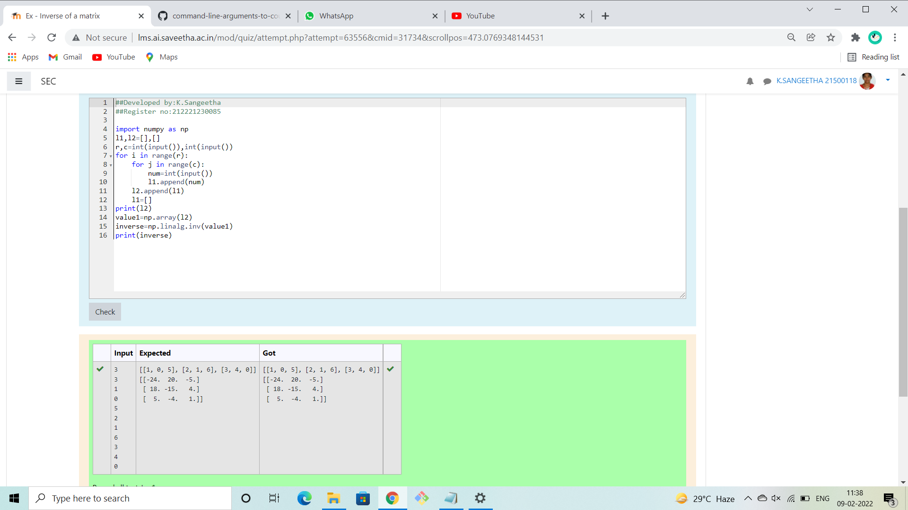

# Inverse-of-matrix

## AIM:
To write a python programming for finding the inverse of a matrix
## ALGORITHM:

### Step 1:
Import numpy as np
### Step 2:
Give the input matrices
### Step 3:
Use forloop,range functiion and append
### Step 4:
Give the inverse formula
### Step 5:
Run the program

## PROGRAM:
```
##Developed by:K.Sangeetha
##Register no:212221230085
import numpy as np
l1,l2=[],[]
r,c=int(input()),int(input())
for i in range(r):
    for j in range(c):
        num=int(input())
        l1.append(num)
    l2.append(l1)
    l1=[]
print(l2)
value1=np.array(l2)
inverse=np.linalg.inv(value1)
print(inverse)
```
## OUTPUT:



## RESULT:
Thus the program is written to find the inverse of the matrices.